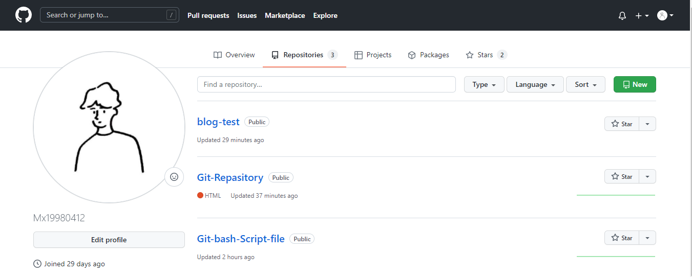

# Mx的自我介绍

## 个人简介
* 姓名：胡棉鑫😀
* 性别：男🚹
* 籍贯：广东汕头🏠
* 生日：1998年4月12日
* 职业：一名有灵魂的前端工程师（努力中💪）

## 爱好
1. 打篮球🏀（从小到现在一直不变的爱好）
2. 玩吃鸡游戏游戏🔫（又菜又爱玩的那种）
3. 目前还是一名小白前端，渐渐喜欢上敲代码，希望也能成为爱好
   
## 编程语言
说来惭愧，都不好意思说我是科班出生的（想挖个墙角钻进去）
现在只会命令行，git，html
那我写一点咯~

`<h1></h1>`

好像有点短，那就再多写一点哈哈
```html
<html>
    <head>
        <title>这是标题</title>
    </head>
    <body>
        <h1>这是1级标题</h1>
        <p>这是段落</P>
    <body>
</html>
```
看来还是得继续啃代码啦，不在这献丑啦/(ㄒoㄒ)/~~

## 个人博客
（还在持续更新中哦~~~）

[我的博客笔记](https://www.yuque.com/mx0412)


[我的GitHub](https://github.com/Mx19980412)




## 目标
希望下次翻看这个博客的我，是一个越来越牛批的码农👨

奥利给🎈